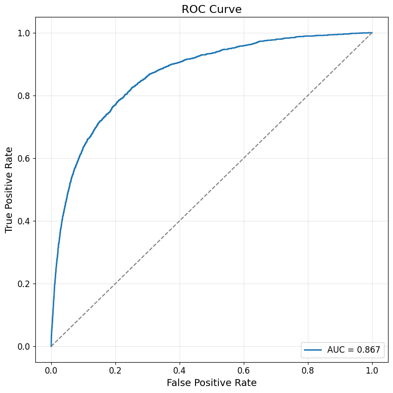
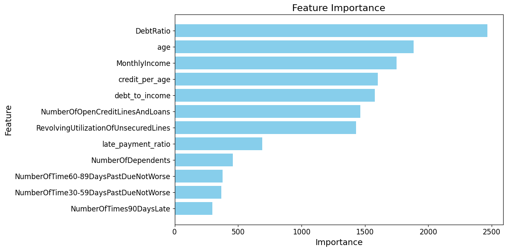

# Credit Scoring — Loan Default Prediction


An end-to-end machine learning project that predicts the probability of a borrower
defaulting on a loan within two years, based on the Kaggle
[Give Me Some Credit](https://www.kaggle.com/c/GiveMeSomeCredit) dataset
(150,000 borrowers). The pipeline covers exploratory data analysis, feature
engineering, gradient-boosting model training with hyperparameter optimization,
threshold selection, and an interactive Power BI dashboard for business users.

> ⚠️ Educational portfolio project — not intended for real lending decisions.

## Results

| Metric | Value |
|---|---|
| **ROC-AUC** (20% stratified hold-out) | **0.867** |
| Precision / Recall / F1 — default class (at threshold 0.40) | 0.57 / 0.31 / 0.40 |
| Accuracy | 0.94 |

The classification threshold (0.40 instead of the default 0.50) was selected
jointly with the hyperparameters by maximizing the F-beta score, trading some
precision for better recall on the rare default class (~6.7% of borrowers).

| ROC curve | Feature importance |
|---|---|
|  |  |

**Key drivers of default risk:** debt ratio, age, monthly income, and the
engineered features `credit_per_age` and `debt_to_income`.

## Project Workflow

### 1. Exploratory Data Analysis — [`01_EDA.ipynb`](notebooks/01_EDA.ipynb)
- Assessed missing values (`MonthlyIncome`, `NumberOfDependents`) and justified an imputation strategy.
- Analyzed feature distributions, heavy right-skew, and extreme outliers (e.g. revolving utilization values up to 50,708).
- Compared defaulters vs. non-defaulters with log-transformed histograms and boxplots.
- Ranked features with a correlation heatmap and mutual information against the target.

### 2. Modeling — [`02_Modeling.ipynb`](notebooks/02_Modeling.ipynb)
- **Preprocessing:** missing-value imputation, outlier clipping at the 95th percentile, dropped a near-zero-signal feature (`NumberRealEstateLoansOrLines`).
- **Feature engineering:** `credit_per_age`, `late_payment_ratio`, `debt_to_income`.
- **Model:** LightGBM classifier; 50-trial [Optuna](https://optuna.org/) study tuning `n_estimators`, `max_depth`, `learning_rate`, `colsample_bytree`, `reg_alpha`, and the classification threshold.
- **Evaluation:** ROC-AUC on a stratified hold-out set, classification report, confusion matrix, and predicted-probability distributions per class.
- Generated predictions for the Kaggle test set.

### 3. Reporting — [`03_PowerBI_prepare.ipynb`](notebooks/03_PowerBI_prepare.ipynb) + [`Report.pbix`](reports/Report.pbix)
- Merged model predictions with client attributes into a BI-ready dataset.
- Built a Power BI dashboard prototype for exploring portfolio risk (open `reports/Report.pbix` in Power BI Desktop).

## Repository Structure

```
Credit_Scoring_Project/
├── data/
│   ├── raw/                    # Kaggle "Give Me Some Credit" dataset + data dictionary
│   └── processed/              # generated outputs (created by the notebooks, not tracked)
├── models/
│   ├── lgbm_model.pkl          # trained LightGBM model
│   └── best_threshold.json     # optimized classification threshold
├── notebooks/
│   ├── 01_EDA.ipynb            # exploratory data analysis
│   ├── 02_Modeling.ipynb       # feature engineering, training, evaluation
│   └── 03_PowerBI_prepare.ipynb# dataset preparation for the dashboard
├── reports/
│   ├── figures/                # exported result plots
│   └── Report.pbix             # Power BI dashboard
├── requirements.txt
└── README.md
```

## Getting Started

```bash
git clone https://github.com/JanIzmer/Credit_Scoring_Project.git
cd Credit_Scoring_Project

python -m venv venv
source venv/bin/activate        # Windows: venv\Scripts\activate

pip install -r requirements.txt
jupyter notebook
```

Run the notebooks in order (`01` → `02` → `03`). The raw dataset is included in
`data/raw/`; all processed outputs are regenerated by the notebooks.
On Windows, `run_jupyter.bat` automates the environment setup.

## Dataset

150,000 borrowers, 10 features, binary target `SeriousDlqin2yrs`
(1 = experienced 90+ days delinquency within two years).

| Feature | Description |
|---|---|
| `RevolvingUtilizationOfUnsecuredLines` | Balance on credit cards and personal lines of credit divided by total credit limits |
| `age` | Age of the borrower (years) |
| `NumberOfTime30-59DaysPastDueNotWorse` | Times 30–59 days past due in the last 2 years |
| `DebtRatio` | Monthly debt payments divided by monthly gross income |
| `MonthlyIncome` | Monthly income |
| `NumberOfOpenCreditLinesAndLoans` | Number of open loans and credit lines |
| `NumberOfTimes90DaysLate` | Times 90+ days past due |
| `NumberRealEstateLoansOrLines` | Number of mortgage and real estate loans |
| `NumberOfTime60-89DaysPastDueNotWorse` | Times 60–89 days past due in the last 2 years |
| `NumberOfDependents` | Number of dependents in the family |

## Tech Stack

**Python** (pandas, NumPy, scikit-learn, LightGBM, Optuna, Matplotlib, Seaborn) ·
**Jupyter Notebook** · **Power BI**

## Author

**Jan Izmer** — [github.com/JanIzmer](https://github.com/JanIzmer)

Built as a portfolio project to demonstrate data analysis and machine learning
skills in the credit-risk domain.
